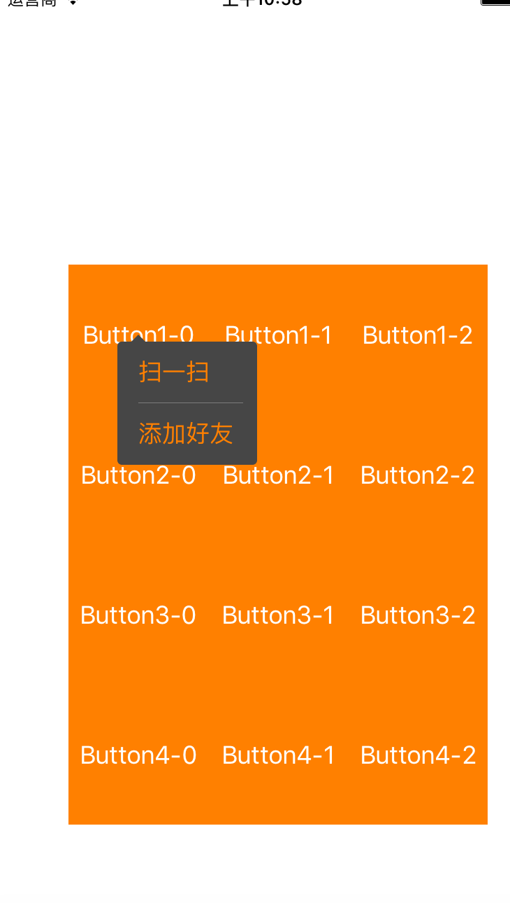
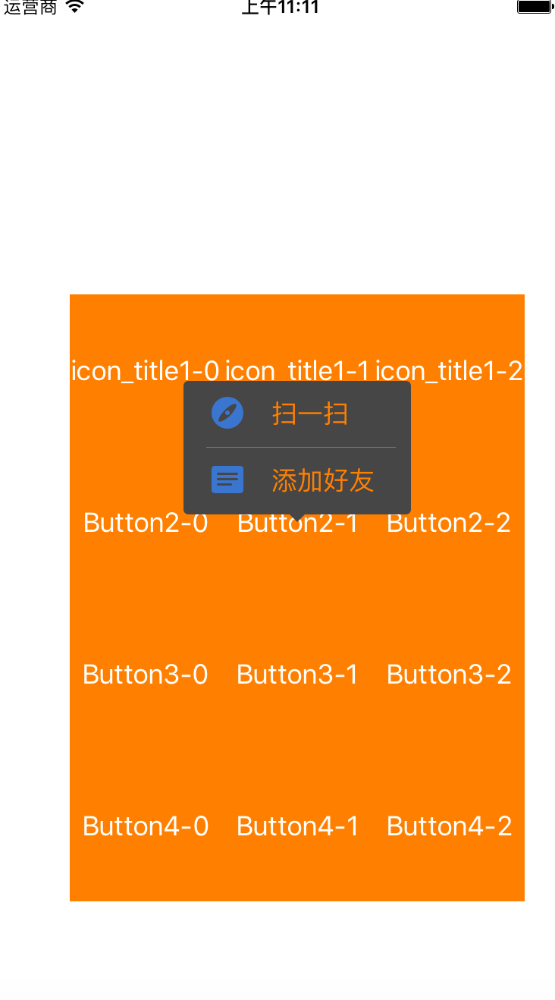

模仿微信加号菜单
=============


完美模仿微信右上角加号点击菜单，三角有4个方向 12个位置

Screenshots
---------




Basic Examples
---------
```objc

PopMeunView *popView = [[PopMeunView alloc] initWithOrigin:sender.center width:100 height:44 * 2 type:sender.tag color:[UIColor colorWithRed:0.2737 green:0.2737 blue:0.2737 alpha:1.0]];
    popView.rowHeight = 44;
    popView.titles = @[@"扫一扫",@"添加好友"].copy;
    popView.images = @[].copy;
    popView.titleColor = [UIColor orangeColor];
    popView.delegate = self;
    
    [popView popView];

```

Title_Icon Examples
-----
```objc
PopMeunView *popView = [[PopMeunView alloc] initWithOrigin:sender.center width:150 height:44 * 2 type:sender.tag color:[UIColor colorWithRed:0.2737 green:0.2737 blue:0.2737 alpha:1.0]];
    popView.rowHeight = 44;
    popView.titles = @[@"扫一扫",@"添加好友"].copy;
    if (sender.tag / 3 == 1) {
       popView.images = @[@"Night_Tabbar_Discover_Highlight",@"Night_Tabbar_Feed_Highlight"].copy;
    }
    popView.titleColor = [UIColor orangeColor];
    popView.delegate = self;
    
    [popView popView];

```

Delegate
---------
```objc

#pragma mark - PopMeunViewDelegate

- (void)selectIndex:(NSInteger)index{
    NSLog(@"%ld",(long)index);
}

```